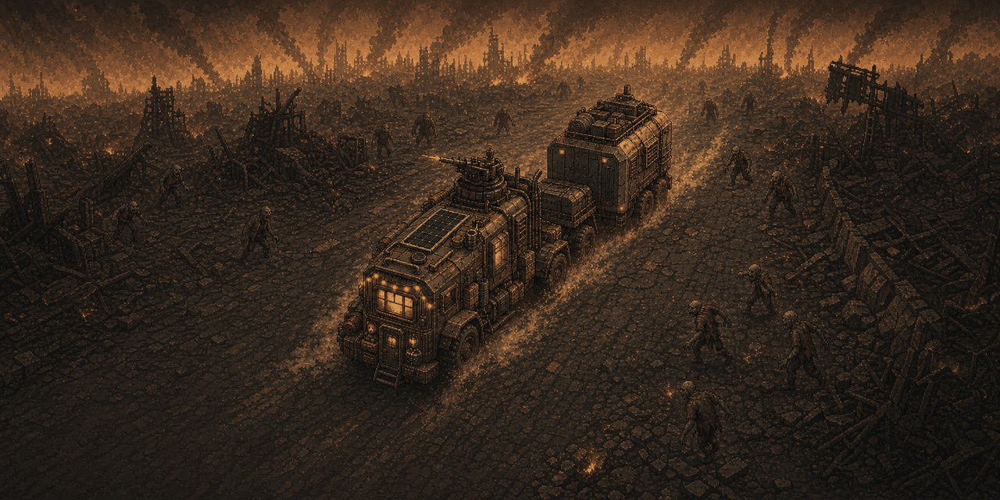
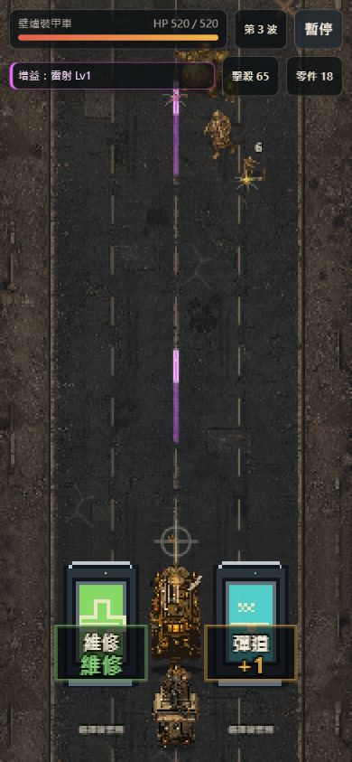
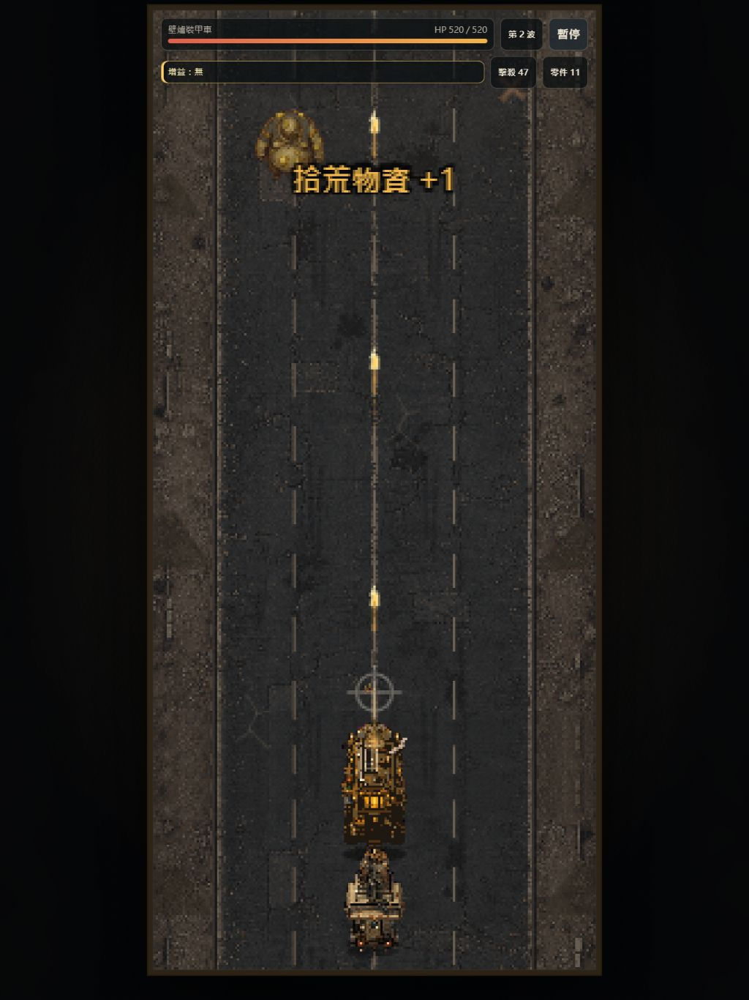
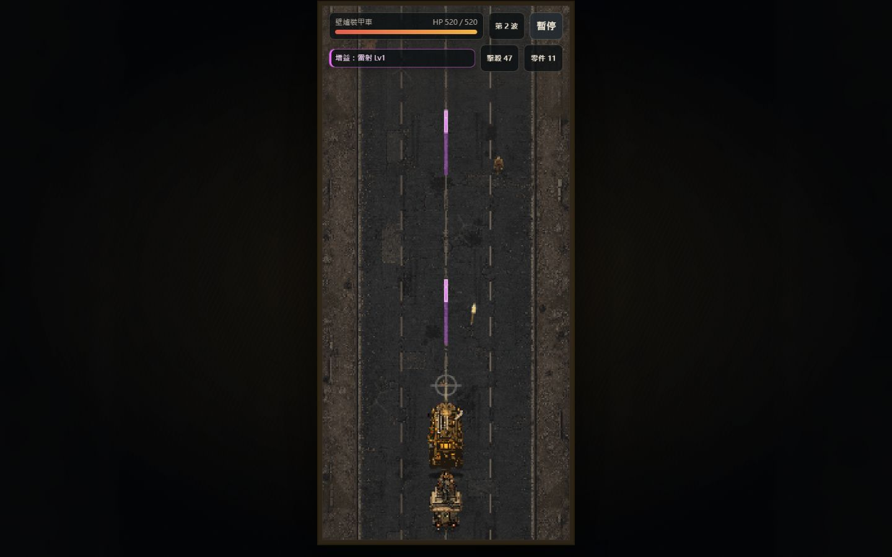

# 灰燼護航 Ashes Convoy

[](https://github.com/mars-tw/ashes-convoy/actions/workflows/ci.yml)
[](src/version.js)
[](LICENSE)

《灰燼護航》是一款手機直式優先的 Canvas 2D 末世護送射擊遊戲。駕駛裝甲載具拖著倖存者車廂穿越屍潮，在每一波中清敵、打破增益門、收集補給，並把零件、藍圖與戰績帶回基地。

**[立即線上遊玩](https://mars-tw.github.io/ashes-convoy/)**



## 最新特色

- **R71–R72 素材重製**：重製首屏、封面、熹的砲手姿勢、主要敵人與 Boss，並統一暖灰燼 painterly-pixel 視覺；R72 的瀝青巨屍、盾殼屍與蜱群使用四個獨立移動姿勢的圖集，環境也加入遠／中／近景深層。
- **R73 敵人動作圖集**：九組 raster 敵人視覺均新增 2 幀受擊與 3 幀死亡動作；low 品質仍以兩個真實 walk 姿勢交替，不再用單張圖位移、旋轉或縮放冒充動畫。
- **熹的拖車房間**：基地內可進入熹的末世房間，閱讀無線電日誌、查看角色狀態，並以出擊進度解鎖或配置房間物件。
- **波次護送玩法**：每波護送車隊深入四種環境，處理屍群、菁英敵人、補給與四類增益門；每 5 波迎戰階段式 Boss。
- **基地系統**：切換與解鎖四台載具、投資通用／專屬升級、領取成就、管理行動與設定，進度保存於瀏覽器本機。
- **行動裝置與 PWA**：單手拖曳操作、響應式直式畫面、離線快取、可調特效／閃光／效能與存檔匯出入。

## 遊戲畫面

| 手機首屏 | 手機戰鬥 | 桌機戰鬥 |
|---|---|---|
|  |  |  |

完整 walk／hurt／death 動作序列與 alpha 差異量測見 [R73 action atlas 證據頁](docs/evidence/R73/action-atlas-proof.html)。

## 玩法

1. 從基地整備載具、升級與拖車房間後出擊。
2. 在戰鬥中移動載具並控制上方準星，優先打破想要的增益門核心。
3. 撐過一般波次、補給抉擇與每 5 波一次的 Boss；波長由 30 秒逐步增加，最高 45 秒。
4. 結算零件、Boss 藍圖、成就與最佳紀錄，再回基地強化下一次出擊。

目前有陸地重裝車、空艇、海上方舟與虛空穿梭機四種載具，各自對應不同環境、武器與專屬成長路線。

## 操作說明

| 輸入 | 操作 |
|---|---|
| 觸控／滑鼠按住拖曳 | 移動載具並調整準星；觸控準星會顯示在手指上方 |
| 放開拖曳 | 保持自動射擊與輔助瞄準，但射擊間隔較長 |
| `←`／`→` | 鍵盤向左／向右移動載具 |
| `Esc` | 暫停／繼續；也可關閉最上層基地面板 |
| `R` | 以目前選定載具重新開始出擊 |
| `1`–`4`，或方向鍵＋`Enter`／空白鍵 | 選擇補給獎勵 |

基地、設定與升級使用畫面上的按鈕操作；手機不需要 hover。

## 技術棧

- 原生 HTML、CSS、JavaScript；無前端框架與打包器。
- HTML5 Canvas 2D 渲染、Web Audio API 程序音效。
- Service Worker、Web App Manifest、localStorage，提供 PWA、離線與本機進度。
- Node.js 測試守門與 Playwright 瀏覽器／RWD 測試。
- GitHub Actions 執行 Node 20 測試並部署 GitHub Pages。

## 本地開發

需求：Node.js 20、npm、Python 3。首次執行瀏覽器測試時另安裝 Playwright Chromium。

```bash
git clone https://github.com/mars-tw/ashes-convoy.git
cd ashes-convoy
npm ci
npm start
```

開啟 <http://localhost:8000/>。專案是靜態網站，`npm start` 實際執行 `python -m http.server 8000`，不需要建置步驟。

### 測試指令

```bash
npm test

# 首次執行 E2E / RWD 前
npx playwright install chromium

npm run test:e2e
npm run test:rwd
```

| 指令 | 範圍 |
|---|---|
| `npm test` | config、automation、visual、animation asset、rules、supply、economy、storage、sprite、FX、audio |
| `npm run test:e2e` | Playwright 遊戲流程、資產 fallback、音訊與離線行為 |
| `npm run test:rwd` | 桌機、平板、手機與橫向視口矩陣 |

## 文件、素材與授權

- [遊戲設計文件](docs/gdd.md)
- [美術與資產契約](docs/art-contract.md)
- [素材來源與致謝](CREDITS.md)
- [MIT License](LICENSE)

目前遊戲版本為 **R73**，權威版本值在 [`src/version.js`](src/version.js)。專案程式碼採 MIT License；第三方素材與開發工具的來源、授權及 `image_gen` 產出標註方式請見 [CREDITS.md](CREDITS.md)。
